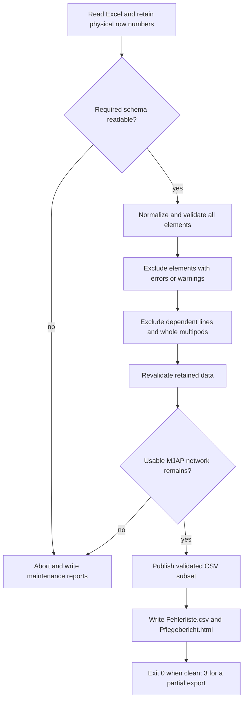
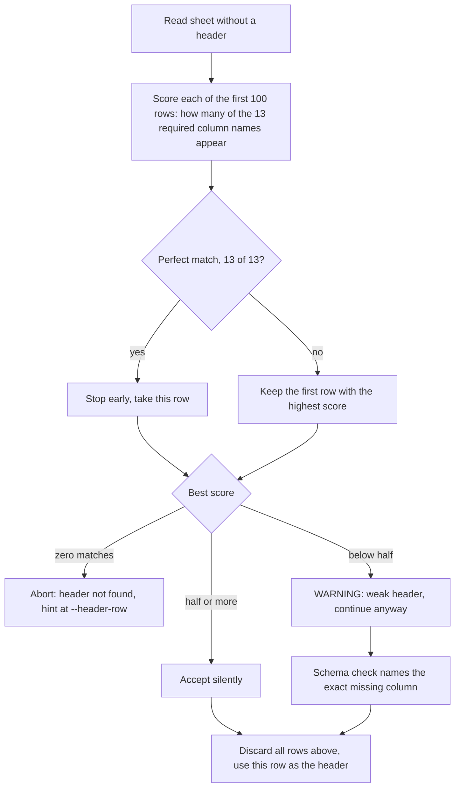
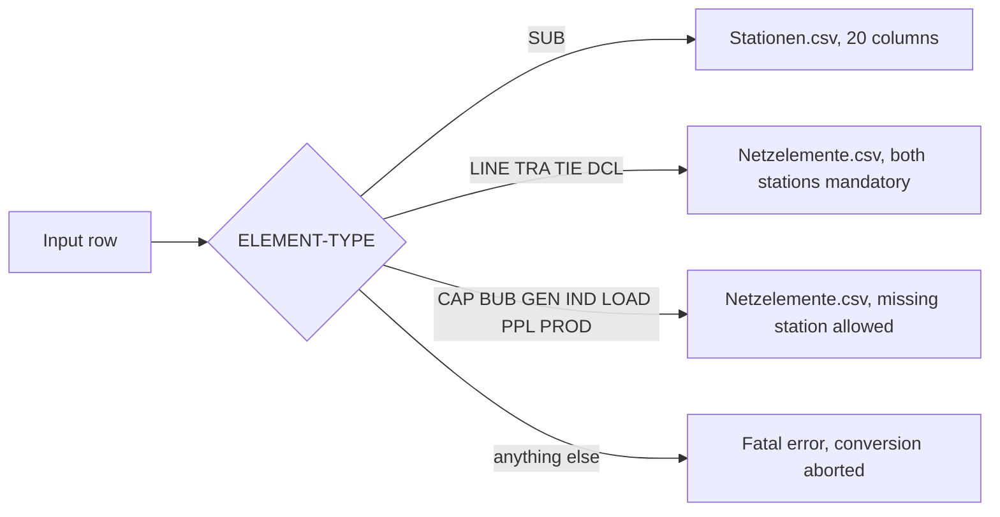
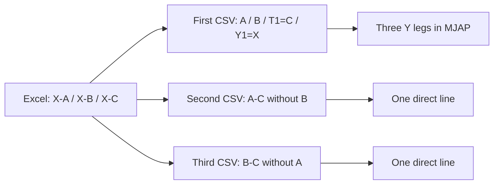
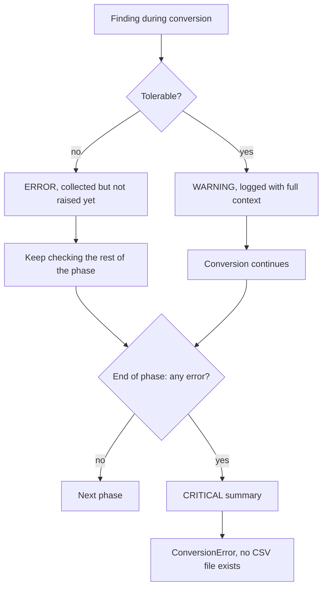
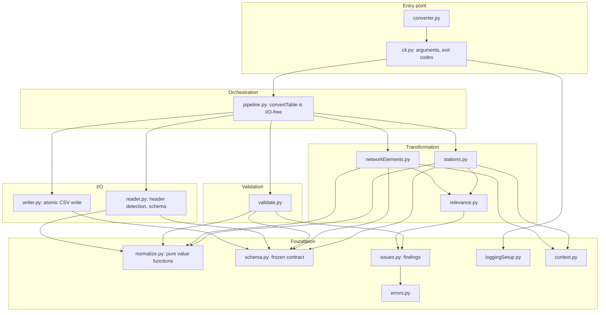
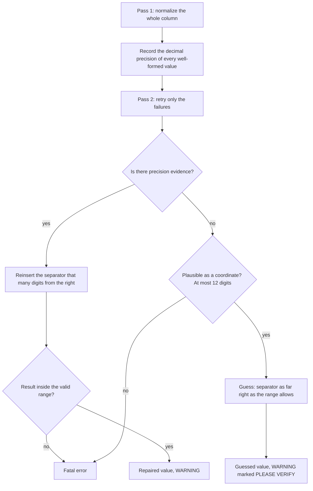

# parser

Das aktive private Repository heißt **parser** und liegt unter
`/Users/hadi/Desktop/nahriva_works/parser`.
[Direkter VS-Code-Debugstart mit Konstanten](DEBUG_PARSER_DE.md): `debug_parser.py`.
Die bisherige Parser-Historie ist erhalten; alle neuen Arbeitsänderungen liegen auf `main`.

The complete German [data handbook](docs/DATENFLUSS_UND_TABELLEN_DE.md) covers
Excel input, every CSV field, logical types, required/optional values, four diagrams
and the MJAP/QGIS outputs. Also included: a [standalone HTML copy](docs/DATENFLUSS_UND_TABELLEN_DE.html),
a [JSON field inventory](docs/datenvertrag.json) and a
[verified dummy example](docs/beispiel/README_DE.md).

**MJAP / QGIS:** The simple CLI command now writes two MJAP-compatible network
tables by default, excluding elements with errors or warnings and their dependencies.
Automatic `Fehlerliste.csv` and `Pflegebericht.html` identify everything to maintain
in the original Excel input; see [the German maintenance guide](docs/TEIL_EXPORT_UND_PFLEGE_DE.md).
Use `--legacy` only for the historical general CSV format.
The optional `--mjap` mode writes a validated four-table bundle. Offline country
maps for Germany, Netherlands, Belgium and France can be added to an existing
QGIS project without changing the MJAP plugin. See [MJAP_DE.md](MJAP_DE.md) for
German instructions, the exact compatibility rules and map commands. Full wizard
exports require nonempty real switching/project CSVs and valid IBN dates; invalid
records are excluded and the remaining bundle must pass validation before writing. See [MJAP_PRUEFBERICHT_DE.md](MJAP_PRUEFBERICHT_DE.md)
for the complete real-QGIS test results.

A production-oriented converter that reads an Excel network inventory and produces
**two MJAP data** CSV files plus automatic maintenance reports: `Stationen.csv` (substations) and `Netzelemente.csv`
(network elements).

The two output headers are an **immutable external contract**. Spelling, order,
hyphens, spaces, capitalization and umlauts are never changed, never translated,
never reordered. Everything in this converter is built around protecting that contract
while refusing to invent data.

Three rules drive every design decision:

1. **Never invent a value.** A field without a defined source stays empty.
2. **Never lose data silently.** Anything unexpected is either a warning or a fatal error.
3. **Publish only a validated subset.** Exclude every element with a finding and its dependent records; publish each complete output file together with the maintenance reports.

---

## Table of contents

- [Quick start](#quick-start)
- [Command line reference](#command-line-reference)
- [How it works](#how-it-works)
- [Finding the header row](#finding-the-header-row)
- [Classification](#classification)
- [Multipod](#multipod)
- [Configurable target format](#configurable-target-format)
- [Error strategy](#error-strategy)
- [Logging](#logging)
- [Module map](#module-map)
- [Field mapping](#field-mapping)
- [Normalization rules](#normalization-rules)
- [Validation rules](#validation-rules)
- [Output format](#output-format)
- [Testing](#testing)
- [Performance](#performance)
- [Design decisions](#design-decisions)
- [Extending the converter](#extending-the-converter)

---

## Quick start

```bash
python -m venv .venv
.venv/bin/python -m pip install -r requirements.txt
```

```bash
python converter.py input.xlsx
```

```bash
python converter.py input.xlsx --output-dir ./output --details
```

The simple command needs only Excel and an output directory. It writes UTF-8-BOM
network CSVs with decimal-comma coordinates, genuine missing topology fields,
paired dates and MJAP type translations. Invalid data aborts before replacing
existing tables. `--details` affects logging, not the output format.

The complete MJAP wizard still requires nonempty `Freischaltungen.csv` and
`Projekte.csv` as well. They are not invented by the two-table export. Existing
companion files in the output directory are preserved.

Requires Python 3.11+. Mandatory dependencies: `pandas`, `openpyxl`, `colorlog`.
`python-calamine` is optional and only makes reading faster — see [Performance](#performance).

---

## Command line reference

| Option | Meaning |
| --- | --- |
| `input` | Path to the input `.xlsx` file |
| `-o`, `--output-dir` | Target directory for both CSV files (default: current directory) |
| `--sheet` | Worksheet name or 0-based index (default: the first worksheet) |
| `--header-row N` | 1-based Excel row holding the column headers (default: detected automatically) |
| `--engine` | `auto` (default), `openpyxl` or `calamine` |
| `--encoding` | Legacy output encoding only; MJAP always uses UTF-8 with BOM |
| `--strict` | Abort the whole MJAP export on any data error or warning; legacy validation remains historical |
| `--legacy` | Historical general format, including lenient validation and space fillers; not MJAP-safe |
| `--mjap` | Complete four-table bundle; needs `--freischaltungen` and `--projekte` |
| `--target-format FILE` | JSON renaming output columns and translating element types |
| `--empty-placeholder TEXT` | Legacy filler only; never applied to the MJAP network export |
| `--quote-all` | Quote every CSV field instead of only those that require it |
| `--log-level` | Console minimum level: `DEBUG`, `INFO` (default), `WARNING`, `ERROR`, `CRITICAL` |
| `--details` | Print every single finding on the console instead of only the summary |
| `--issue-file PATH` | Write every error and warning to a workable list, sorted by Excel row |
| `--debug-file PATH` | Also write a full `DEBUG`-level log to this file, independent of `--log-level` |
| `--color` / `--no-color` | Force or disable colored log output |

**Exit codes**

| Code | Meaning |
| --- | --- |
| `0` | Clean MJAP export — no elements excluded |
| `3` | Validated partial export published — excluded elements are listed in the automatic reports |
| `2` | Conversion failed; default MJAP tables are not replaced. Legacy mode may still write invalid records |
| `1` | Unexpected error (bug); a full traceback is logged |

---

## How it works

The pipeline is strictly ordered: **everything is validated before anything is written.**
Stations are always collected before network elements, so a network element may reference
a station that appears *later* in the spreadsheet.



Why this order matters:

* **Header first** — row numbers in every later message refer to the real Excel row.
* **Types before splitting** — a row whose `ELEMENT-TYPE` is unknown cannot be routed to
  either file, so it is reported and dropped rather than written with a bogus type.
* **Stations before elements** — the station index must exist before references are
  checked, which makes the result independent of row order in the spreadsheet.
* **Writing last** — every value is normalized and checked before a single byte is written.

---

## Finding the header row

The header is not necessarily in row 1. Real exports carry a title, an export date and
notes above it. The header position is therefore **detected automatically**; no row
number is hard-coded anywhere.

```
 1 │ Network inventory export
 2 │ As of: 14.08.2026            Owner: grid planning
 3 │
 4 │ Note: do not write above the header row
 5 │ TSO │ ELEMENT ID │ LONG-NAME │ … ← header detected here
 6 │ 50Hertz │ HRA_380 │ UW Hranice │ …   ← first data row = Excel row 6
```

### Detection algorithm



Matching is case-insensitive and whitespace-tolerant, so `  element id ` matches
`ELEMENT ID`.

```
INFO     reader.py:208   Header detected in row 5 - skipping 4 leading row(s) above it.
INFO     reader.py:361   Found 6 data row(s) below the header.
```

### Why a weak match is accepted rather than rejected

If a row matches only 2 of 13 required columns, reporting *"header not found"* is far less
useful than reporting *"missing required input column: LONG-NAME"*. So a weak candidate is
accepted with a `WARNING`, and the schema check produces the precise, actionable list.
Only a sheet where **no** row contains **any** required column name is rejected outright.

### Edge cases

| Situation | Behaviour |
| --- | --- |
| Header in row 1 | Detected normally, no rows skipped |
| Preamble text mentioning a few column names | Cannot outrank the real header, which matches far more |
| Empty cells inside the header row | Named `Unnamed: <position>` |
| Duplicate column names after normalization | Fatal — the mapping would be ambiguous |
| Header further down than row 100 | Use `--header-row N` |
| Detection wrong for any reason | `--header-row N` overrides it completely |

**Row numbers always refer to the real Excel row.** With the header in row 5, the first
data row is reported as `Row: 6`. This is verified for preamble lengths of 0, 1, 4, 9 and 25.

---

## Classification

`ELEMENT-TYPE` decides which file a row ends up in. The check is case-insensitive;
internally the value is always uppercase.



### Real vs. virtual substations

A station whose name (the part **before the last** `_`) starts with `X` is a virtual
X node.

| `ELEMENT ID` | Station name | `reales UW` |
| --- | --- | --- |
| `Berlin_380` | `Berlin` | `Wahr` |
| `HRA_380` | `HRA` | `Wahr` |
| `Xb_380` | `Xb` | `Falsch` |
| `Xfoo_220` | `Xfoo` | `Falsch` |
| `Station_A_110` | `Station_A` | `Wahr` |

Virtual stations already exist as their own `SUB` rows in the input. **None are created,
and no coordinates are ever computed.** Both real and virtual stations require valid
coordinates.

---

## Multipod

**Excel is the input.** A three-legged line needs four `SUB` rows (A, B, C,
virtual node X) and three line rows. Each line connects X to one distinct outer
station and carries X's raw `ELEMENT ID` in `Multipod`. Either endpoint direction
is accepted. X must already exist with its own coordinates; nothing is invented.

Example Excel line rows, in this order:

| ELEMENT ID | LONG-NAME | Station 1 | Station 2 | Multipod |
| --- | --- | --- | --- | --- |
| LINE_001 | Leitung xy | XStationK_380 | StationA_380 | XStationK_380 |
| LINE_002 | Leitung xy | XStationK_380 | StationB_380 | XStationK_380 |
| LINE_003 | Leitung xy | XStationK_380 | StationC_380 | XStationK_380 |

Three Excel line rows become **exactly three CSV records**, retaining their IDs
and per-row dates, owners and other attributes. Excel row order assigns A/B/C:

| Source row | Start | End | T-1 | Y1 | Name |
| --- | --- | --- | --- | --- | --- |
| First | A | B | C | X | Its original LONG-NAME |
| Second | A | C | empty | empty | Its LONG-NAME + ` (ohne Bein StationB_380)` |
| Third | B | C | empty | empty | Its LONG-NAME + ` (ohne Bein StationA_380)` |

Only the first record has `Station T-1` / `Station T-1:MJAP-ID` and
`Y-Knoten-1` / `Y-Knoten-1: MJAP-ID`. Station columns contain the resolved full
MJAP-IDs; plain Y1 contains the raw node ID. T-2 and Y2 remain empty throughout.
Both long and short circuit names receive the suffixes. The virtual node occurs
once in `Stationen.csv`; there is no fourth summary record in `Netzelemente.csv`.

The unchanged MJAP plugin creates **five line features**: A-X, B-X, C-X for the
full Y record, plus direct A-C and B-C for the pair records. Pair lines do not
follow X. An outage of the first retained element ID affects all three Y legs;
the other IDs affect their respective pair. Retained source IDs therefore have
new connection semantics; Excel order and per-leg attributes need deliberate
business review.



Groups are keyed by the normalized `Multipod` reference and require exactly
three distinct outer SUB stations, the same voltage and the same line type
(`LINE`, `TIE` or `DCL`). Incomplete groups, repeated endpoints, several circuits
sharing one node, and four-leg groups are reported as errors. The default MJAP network export and `--mjap` exclude the complete group.
`--strict` aborts the entire export; `--legacy` without `--strict` retains its historical behavior.
A four-leg star at one node cannot be inferred as MJAP's double-Y, which needs
two virtual nodes. `Station T-2` alone is insufficient.

A missing referenced SUB node is an error. An existing node without the capital
X naming convention yields a warning; the MJAP CLI therefore excludes the affected group. Historical API/legacy conversion keeps the reference unchanged. An empty or absent
`Multipod` leaves ordinary point-to-point conversion unchanged. `Map Multipod`
is ignored.

A replayable [Excel-first three-leg example](docs/beispiel/dreibein/README_DE.md)
includes the workbook, generated CSVs and actual full-wizard report.

---

## Configurable target format

Output column names and `Element Typ` values are a contract with the consuming system -
and that contract changes without the converter changing. A JSON file therefore renames
columns and translates element types, so a rename never needs a code change:

```bash
python converter.py input.xlsx --legacy --target-format targetFormat.json
```

```json
{
  "elementTypes": {"LINE": "Stromkreis", "TRA": "Transformator"},
  "stationColumns": {"MJAP-ID": "Anlagen-ID"},
  "networkElementColumns": {"Element Typ": "Betriebsmitteltyp"}
}
```

Every key is optional; anything not listed keeps its contract name. `targetFormat.example.json`
ships a full element-type translation to start from. Keys beginning with `_` are treated as
comments.

**This affects the target format only.** Input column names are untouched, and so is the
internal classification: a row with `ELEMENT-TYPE = SUB` still becomes a station even when
`SUB` is translated for the output. The translation is the last step before writing, so the
contract check still sees the canonical names.

Guard rails: a rename that would give two columns the same name is rejected outright, and a
rename pointing at a column that does not exist is reported as a warning rather than failing
silently.

---

## Error strategy



| Level | Meaning |
| --- | --- |
| `DEBUG` | Internal detail (column renames, schema checks, virtual node detection) |
| `INFO` | Normal progress — file, sheet, header row, counts, results |
| `WARNING` | Tolerable finding; the conversion continues with a documented fallback |
| `ERROR` | A real data defect. Reported in full; the affected cell stays empty |
| `CRITICAL` | The closing summary of a flawed run — or the abort itself under `--strict` |

### Historical lenient mode (`--legacy`)

The default CLI export excludes elements with findings and validates the remaining MJAP subset. The behavior below applies only
to `--legacy` (and the historical Python API default).

In legacy mode an error is **reported, not fatal**: both CSV files are written anyway, and the
log is the list of things to fix.

```
CRITICAL Completed WITH 2 error(s) and 3 warning(s). The CSV files are written
         anyway - fix the errors listed above and rerun.
INFO     Conversion finished: 3 station(s), 4 network element(s), 2 error(s), 3 warning(s).
```

The exit code is still `2`, so automation does not mistake a flawed run for a clean one —
but the files exist and can be inspected.

What a faulty row looks like in the output:

| Defect | Result |
| --- | --- |
| Missing mandatory `Station 2` | `Station Ende` empty (no `NaN` literal — the value is genuinely missing) |
| Reference to a station that does not exist | The raw value is kept, `…:MJAP-ID` stays empty |
| `SUB` without coordinates | `lat` / `long` empty |
| Unparsable date | `IBN` / `ABN` empty |
| Unknown `ELEMENT-TYPE` | **Row dropped** — it cannot be routed to either file; reported and counted |

Two things stay fatal regardless, because they are not data defects:
a missing required input column and any breach of the output schema itself.

`--strict` makes legacy validation strict: the run aborts at the end of the failing
phase and not a single CSV file comes into existence.

Every finding carries as much context as available:

```
ERROR    networkElements.py:69  Validation failed.
         Row: 184
         ELEMENT ID: LINE_471
         ELEMENT-TYPE: LINE
         Field: Station 2
         Value: <empty>
         Problem: Required station reference is missing.
         Expected: LINE requires Station 1 and Station 2.
```

### One deliberate deviation from the specification

The specification says to abort on the first fatal error. This implementation collects
**all** errors within a phase, logs each one in full, and aborts at the phase boundary.
You therefore see every problem in a single run instead of fixing them one at a time.

Both files are first written to temporary files in the target directory and only then
moved atomically into place, so even an I/O failure cannot leave a half-written output
behind.

---

## Logging

All output goes through `logging` — the converter contains no `print()` statements.

Every line shows the level, **the source file and line that produced it**, and the message.
Multi-line findings are indented and separated by a blank line so blocks never run together:

```
INFO     reader.py:119          Using worksheet: Netzdaten
INFO     reader.py:208          Header detected in row 5 - skipping 4 leading row(s) above it.
INFO     stations.py:92         Found 3 station(s).

WARNING  relevance.py:128       Tolerable issue.
         Row: 8
         ELEMENT ID: Xb_380
         ELEMENT-TYPE: SUB
         Field: Station 2
         Value: <empty>
         Problem: Station reference is missing.
         Action: Writing NaN and continuing.

INFO     networkElements.py:92  Found 3 network element(s).
```

The source location points at the **domain module that found the problem**
(`stations.py`, `networkElements.py`, `validate.py`, `relevance.py`), not at the shared
error collector — `IssueCollector` logs with `stacklevel=2` so the caller's frame is
recorded. This is covered by tests.

Colors: `DEBUG` dim, `INFO` green, `WARNING` yellow, `ERROR` red, `CRITICAL` white on red.
Colors come from `colorlog` when installed, with a built-in ANSI table as fallback, and are
disabled automatically when stderr is not a TTY or `NO_COLOR` is set.

### Working through the findings

The CLI always writes `Fehlerliste.csv` and `Pflegebericht.html` into the output directory.
These are maintenance artifacts, not MJAP input tables.

`--issue-file PATH` additionally writes every error and warning of the run to one workable list —
**including the run that aborted**, which is exactly the run whose errors need fixing:

```bash
python converter.py input.xlsx --issue-file issues.csv
```

A `.csv` target opens straight in Excel next to the input workbook, sorted by `Row`:

| Severity | Row | ELEMENT ID | ELEMENT-TYPE | Field | Value | Problem |
| --- | --- | --- | --- | --- | --- | --- |
| WARNING | 3 | Berlin_220 | SUB | ELEMENT ID | Berlin_220 | Station ELEMENT ID does not follow the convention |
| WARNING | 7 | GEN_42 | GEN | Station 2 | `<empty>` | Station reference is missing |
| ERROR | 9 | LINE_999 | LINE | Station 1 | NICHT_DA_380 | Station reference does not match any station |

Findings are ordered by Excel row, errors before warnings on the same row, and
schema-level findings without a row last. The file carries a UTF-8 BOM so umlauts
survive a double-click into Excel. Any other suffix (`.log`, `.txt`) produces the same
readable blocks as the console instead.

A failure raised outside the row-level validation — a missing input column, an
unreadable file — has no row context, so the message itself becomes the single entry
rather than leaving an empty report behind. A completely clean run writes a header-only
file, which proves the run was checked rather than skipped.

`--issue-file` and `--debug-file` are independent and can be combined: the first is the
short list of things to fix, the second the full trace of what happened.

### The console stays readable

By default the console shows **progress plus a grouped summary** — not one block per
finding. A file with hundreds of small defects would otherwise scroll the useful
information off the screen:

```
INFO     stations.py:184        Found 8 station(s).
WARNING  pipeline.py:139        Removing 5 network element(s) without a usable station
                                reference from the output.
INFO     networkElements.py:180 Found 1 network element(s).

CRITICAL pipeline.py:156        1 error(s) and 9 warning(s). Use --details for every
                                single finding, --issue-file to export them.
         ERROR       1x  Station reference does not match any station.
         WARNING     5x  Network element has no usable station reference.
         WARNING     4x  Station reference is missing.
```

The findings are grouped by kind, errors first, then by frequency — so the dominant
problem is the first thing you read. On the sample above this is 19 lines instead of 115.

`--details` prints every individual block on the console as well. The detail blocks are
logged to a separate child logger which only the **console handler** filters, so
`--issue-file` and `--debug-file` always receive everything regardless of the flag.

### Capturing a full debug log

`--log-level` controls what the console shows. Independently, `--debug-file PATH` writes
**everything**, including `DEBUG` detail, to a plain-text file — useful for sharing a full
trace of a run without flooding the console:

```bash
python converter.py input.xlsx --log-level WARNING --debug-file run.log
```

The console stays quiet (only warnings and errors), while `run.log` receives every message
at every level, with no ANSI color codes, so it can be opened, grepped or attached to a bug
report directly. The file is overwritten on each run, not appended to.

---

## Module map



| File | Responsibility |
| --- | --- |
| `converter.py` | CLI entry point (`python converter.py input.xlsx`) |
| `excelToCsv/cli.py` | Argument parsing, exit codes |
| `excelToCsv/schema.py` | Frozen contract: required input columns, valid types, exact output headers |
| `excelToCsv/reader.py` | Excel I/O, header detection, column normalization, schema check |
| `excelToCsv/normalize.py` | Pure value functions: date, voltage, coordinate, boolean, text, station id |
| `excelToCsv/relevance.py` | Dynamic `Interesting/Relevant for` columns → semicolon-separated text |
| `excelToCsv/stations.py` | `SUB` rows → station records |
| `excelToCsv/networkElements.py` | All other valid types → network element records |
| `excelToCsv/validate.py` | Element types, duplicates, reference integrity, output schema |
| `excelToCsv/writer.py` | Atomic CSV writing |
| `excelToCsv/pipeline.py` | Orchestration; `convertTable()` is I/O-free and directly testable |
| `excelToCsv/issues.py` | Collecting and formatting findings |
| `excelToCsv/context.py` | Shared row/context data structures |
| `excelToCsv/loggingSetup.py` | Colored block logging |
| `excelToCsv/errors.py` | `ConversionError`, `NormalizationError` |

Transformation and I/O are separated on purpose: `pipeline.convertTable(table, logger)`
works purely on data and can be tested without an Excel file at all.

---

## Field mapping

### `Stationen.csv` — 20 columns

| # | Output column | Source | Transformation |
| --- | --- | --- | --- |
| 1 | `Eigentümer` | `TSO` | trimmed text |
| 2 | `MJAP-ID` | `TSO`, `ELEMENT ID` | `<Eigentümer>_<ELEMENT ID>` |
| 3 | `Stationsname - Langname` | `LONG-NAME`, `ELEMENT ID` | long name; fallback `<LONG-NAME>_<ELEMENT ID>` if the id is not `<name>_<voltage>` |
| 4 | `lat` | `Latitude` | normalized decimal, range checked |
| 5 | `long` | `Longitude` | normalized decimal, range checked |
| 6 | `Spannung` | `VOLTAGE-LEVEL` | JSON list, e.g. `["380","110"]` |
| 7 | `IBN` | `STARTLIFETIME` | `DD.MM.YYYY` |
| 8 | `ABN` | `ENDLIFETIME` | `DD.MM.YYYY` |
| 9 | `Stationsname - Kurzname` | `LONG-NAME`, `ELEMENT ID` | same value as the station long name |
| 10 | `reales UW` | derived from `ELEMENT ID` | `Wahr` / `Falsch` |
| 11 | `Stationsname - OPC-Name` | — | empty |
| 12 | `ID-GUID intern-1` | — | empty |
| 13 | `ID-GUID intern-2` | — | empty |
| 14 | `ID-OPC` | — | empty |
| 15 | `ID-UCTE` | `UCTE CODE` | trimmed text |
| 16 | `relevant für` | relevance columns | matching organisations joined with `;` |
| 17 | `ID` | `UCTE CODE` | identical to `ID-UCTE` |
| 18 | `Kommentar` | `DESCRIPTION` | trimmed text |
| 19 | `IBN - Mehrfach` | — | empty |
| 20 | `ABN - Mehrfach` | — | empty |

### `Netzelemente.csv` — 30 columns

| # | Output column | Source | Transformation |
| --- | --- | --- | --- |
| 1 | `Eigentümer` | `TSO` | trimmed text |
| 2 | `MJAP-ID` | `TSO`, `ELEMENT ID` | `<Eigentümer>_<ELEMENT ID>` |
| 3 | `Stromkreisname - Langname` | `LONG-NAME` | trimmed text; pair rows add excluded-leg suffix |
| 4 | `Region` | — | empty (`CCR/ROA` is explicitly **not** used) |
| 5 | `Element Typ` | `ELEMENT-TYPE` | uppercase |
| 6 | `Spannung` | `VOLTAGE-LEVEL` | normalized **text**, e.g. `380/110`, `DC` |
| 7 | `relevant für` | relevance columns | matching organisations joined with `;` |
| 8 | `IBN` | `STARTLIFETIME` | `DD.MM.YYYY` |
| 9 | `ABN` | `ENDLIFETIME` | `DD.MM.YYYY` |
| 10 | `IBN - Mehrfach` | — | empty |
| 11 | `ABN - Mehrfach` | — | empty |
| 12 | `Station Anfang` | `Station 1` | **MJAP-ID** of the referenced station, or `NaN`; Multipod groups remap endpoints as above |
| 13 | `Station Ende` | `Station 2` | **MJAP-ID** of the referenced station, or `NaN`; Multipod groups remap endpoints as above |
| 14 | `Station T-1` | Multipod group | third outer station, only in first Y record |
| 15 | `Station T-2` | — | empty |
| 16 | `Y-Knoten-1` | `Multipod` | Referenced raw virtual-station ID, only in first complete Y record |
| 17 | `Y-Knoten-2` | — | empty (no rule defined yet) |
| 18 | `Stromkreisname - Kurzname` | `LONG-NAME` | same as long name for now |
| 19 | `Stromkreisname - OPC-Name` | — | empty |
| 20 | `ID-GUID intern-1` | — | empty |
| 21 | `ID-GUID intern-2` | — | empty |
| 22 | `ID-OPC` | — | empty |
| 23 | `ID-UCTE` | `UCTE CODE` | trimmed text |
| 24 | `ID` | — | empty (no defined source) |
| 25 | `Station Anfang:MJAP-ID` | referenced station's `TSO`, `ELEMENT ID` | identical to `Station Anfang` |
| 26 | `Station Ende:MJAP-ID` | referenced station's `TSO`, `ELEMENT ID` | identical to `Station Ende` |
| 27 | `Station T-1:MJAP-ID` | Multipod group | resolved third outer station, only in first Y record |
| 28 | `Station T-2:MJAP-ID` | — | empty |
| 29 | `Y-Knoten-1: MJAP-ID` | `Multipod` | resolved virtual station, only in first complete Y record |
| 30 | `Y-Knoten-2: MJAP-ID` | — | empty |

### Ignored input columns

`CCR/ROA`, `ACTION`, `Map Multipod`, `OPC INTERESTING ASSET`, `OPC Map only`,
`interconnector …`. They may be present or absent and never influence the result.
**No OPC logic is implemented.** `Multipod` itself is evaluated - see [Multipod](#multipod);
`Map Multipod` remains irrelevant.

---

## Normalization rules

### Voltage

Target is always **text**, never a number, so non-numeric business values survive.

| Input | Station output | Element output |
| --- | --- | --- |
| `380.0` | `["380"]` | `380` |
| `110.0` | `["110"]` | `110` |
| `380.0/110.0` | `["380","110"]` | `380/110` |
| `DC` | `["DC"]` | `DC` |
| `0.4` | `["0.4"]` | `0.4` |
| empty | `[]` | empty |

### Coordinates

Accepts `52.459373`, `"52,459373"` and native Excel numbers; always written with a dot.
Validated against latitude −90…90 and longitude −180…180. Required for **every** `SUB`
row, real or virtual. Missing, non-numeric or out-of-range values are fatal.

If a value contains both `.` and `,` the **last** separator is treated as the decimal
separator and a `WARNING` is logged.

#### Repairing a forgotten decimal separator

A coordinate typed without its separator — `52459373` instead of `52.459373` — is
repaired automatically and reported as a `WARNING`:

```
WARNING  stations.py:106        Tolerable issue.
         Row: 3
         ELEMENT ID: Berlin_220
         ELEMENT-TYPE: SUB
         Field: Latitude
         Value: 52517037
         Problem: Coordinate had no decimal separator - it was reinserted using the
                  6-decimal precision of this column (52517037 -> 52.517037).
         Expected: A decimal number using '.' or ',' as decimal separator.
         Action: Writing the corrected value 52.517037 and continuing.
```

The position of the separator **cannot be derived from the number itself**: `13361402` is
equally consistent with `13.361402` and `133.61402`, and both are valid longitudes. Picking
"the largest integer part that fits the range" would silently produce `133.61402` — a
plausible but wrong value, exactly the kind of silent corruption this converter exists to
prevent.

The precision is therefore taken from the column's own intact values:



**Derived beats guessed.** A single intact value anywhere in the column is enough to
replace the guess with a reconstruction. The guess only runs when *no* value in the whole
column carries a separator — and then the column itself is flagged once, up front:

```
WARNING  stations.py:96   Column 'Longitude' contains no value with a decimal separator,
                          so its precision is unknown. Separator positions will be
                          guessed and must be verified.
```

### The guess is a guess

Placing the separator as far right as the range allows is correct whenever the original
integer part used the maximum number of digits the range permits. It is **wrong** otherwise,
and latitude and longitude behave differently because their ranges differ:

| Original | Without separator | Guessed | |
| --- | --- | --- | --- |
| `52.459373` (lat) | `52459373` | `52.459373` | ✅ latitude allows 2 integer digits |
| `18.5737` (lat) | `185737` | `18.5737` | ✅ |
| `13.361402` (lon) | `13361402` | `133.61402` | ❌ longitude allows 3 |
| `9.993682` (lon) | `9993682` | `99.93682` | ❌ |

So a run with **no** precision evidence at all needs its output checked — that is what the
`PLEASE VERIFY` warning is for. In the normal case, where the separator was forgotten only
in individual cells, the intact cells supply the precision and the result is exact.

Guard rails, so the repair never invents data:

| Situation | Behaviour |
| --- | --- |
| Value in range without a separator (`52`, `65`) | Left untouched — a legitimate coordinate, and an undetectable loss |
| Out of range **with** a separator (`152.5`) | Fatal — a genuine data error, never reinterpreted |
| Fewer digits than the known precision (`524` at 6 decimals) | Fatal — would fabricate a near-zero value |
| Still out of range after the repair | Fatal |
| More than 12 digits | Fatal — corrupt data, not a missing separator |
| Non-digit characters | Fatal |

The dominant precision wins; on a tie the higher precision is used so no digit is lost.

### Dates

`STARTLIFETIME → IBN`, `ENDLIFETIME → ABN`, always `DD.MM.YYYY`.

| Input | Output |
| --- | --- |
| `2025-05-09` | `09.05.2025` |
| `09/05/2025` | `09.05.2025` |
| `2025-05-09 00:00:00` | `09.05.2025` |
| Excel date cell | `09.05.2025` |
| Excel serial `45786` | `09.05.2025` |
| `09.09.1900;02.05.2011` | `09.09.1900;02.05.2011` |
| `2025-05-09;09/05/2025` | `09.05.2025;09.05.2025` |
| empty | empty |
| `irgendwann` | **fatal error** |

Formats are tried from an explicit, ordered list — ISO first, then day-first. There is no
`dayfirst` guessing, so the result is deterministic. A non-empty value that cannot be
parsed is never passed through unchanged.

### `relevant für`

Columns whose header contains `Interesting` or `Relevant for` are detected dynamically and
the organisation name is extracted from the header — preferably from the parentheses.

The columns are **free-text tick boxes**, not boolean fields: in practice they hold `1`,
`"1"`, `R`, `l`, `x` or whatever the maintainer used to mark a row. The rule is therefore
**everything except an explicit zero counts as relevant**:

| `50Hertz` | `Amprion` | `TennetD` | Result |
| --- | --- | --- | --- |
| `1` | `0` | `R` | `50Hertz;TennetD` |
| `R` | `l` | `0` | `50Hertz;Amprion` |
| `x` | empty | `0` | `50Hertz` |
| `0` | `0` | `0` | empty |
| empty | empty | empty | empty |

Not relevant: `0`, `"0"`, `0.0`, and the unambiguous words `false` / `nein` / `no`.
An empty cell is no marker at all and counts as not relevant. Everything else — any
non-empty text — counts as relevant, so arbitrary markers never produce a warning.

`OPC INTERESTING ASSET` contains the word "interesting" but is an explicitly ignored
business column and is never treated as a relevance column.

---

## Validation rules

| Check | Level | Detail |
| --- | --- | --- |
| Missing required input column | fatal | Each missing column is named individually |
| Unknown `ELEMENT-TYPE` | fatal | Aborts before any record is built |
| Empty `ELEMENT ID` | fatal | The record cannot be named or referenced reliably |
| Empty `TSO` | fatal | The owner is required for `<owner>_<ELEMENT ID>` |
| `SUB` without latitude or longitude | fatal | Applies to virtual stations too |
| Coordinate out of range | fatal | Lat −90…90, long −180…180 |
| Multipod references a missing SUB row | fatal | No dangling reference reaches the Y node columns |
| Multipod references a SUB row without the X convention | warning | The reference is intact; nothing is renamed |
| Coordinate without a decimal separator | warning | Rebuilt from the column's precision, or guessed and marked `PLEASE VERIFY` |
| Unparsable date | fatal | No broken date is ever passed through |
| `LINE`/`TRA`/`TIE`/`DCL` missing a station | fatal | Both references are mandatory |
| `CAP`/`BUB`/`GEN`/`IND`/`LOAD`/`PPL`/`PROD` missing a station | warning | Writes literal `NaN`, continues |
| Station reference not found in any `SUB` row | fatal | No broken references reach the CSV |
| Duplicate station `ELEMENT ID` | fatal | All affected rows are listed |
| Duplicate element id, identical records | warning | Both rows are kept |
| Duplicate element id, conflicting records | fatal | All affected rows are listed |
| Output column set or order mismatch | fatal | Guards the external contract |
| Any remaining NA value in the output | fatal | Prevents stray `nan` strings |

---

## Output format

The **CLI default** uses MJAP serialization: UTF-8 with BOM, decimal-comma
coordinates, truly empty unused T/Y references, paired IBN/ABN text and
`TRA -> Trafo`. The two files are staged together and restored on ordinary
write/publication errors. This does not guarantee a transaction across abrupt
process death or concurrent readers. The known general-space format can produce
`KeyError: MJAP-ID` in MJAP because no valid shape survives its topology filters.

The format and examples below describe **`--legacy`**, not the CLI default.

* UTF-8, comma separated, LF line endings, no index column, no extra columns
* Headers exactly as specified, in exactly the specified order
* Umlauts preserved
* Fields are quoted per RFC 4180 — a JSON list appears in the file as
  `"[""380"",""110""]"` and any CSV reader returns `["380","110"]` from it
* `--quote-all` quotes every field instead
* Written atomically: temporary file first, then moved into place

Example (abridged):

```csv
Eigentümer,MJAP-ID,Stationsname - Langname,lat,long,Spannung,IBN,ABN,...
Amprion,Amprion_Berlin_380,Umspannwerk Berlin,52.459373,13.361402,"[""380""]",17.03.2001,,...
TennetD,TennetD_Xb_380,X-Knoten b,51,6.5,"[""380""]",,,...
```

### Columns that are empty in every row

Several output columns have no defined source and therefore stay empty in every row —
`Region`, `ID`, `IBN - Mehrfach`, `Station T-2`, `Y-Knoten-2` and friends. A column can
also end up empty by accident, for instance `IBN` in a file where no lifetime dates are
maintained.

`pandas.read_csv` types such a column as `float64` full of `NaN`, and a reader then gets:

```
AttributeError: Can only use .str accessor with string values!
```

To keep the output usable, those columns are written with a **single space** instead of a
truly empty field. It carries no business meaning, is indistinguishable from empty in a
spreadsheet, and is enough for pandas to infer a text column:

| Column | Written | `read_csv` dtype | `.str` works |
| --- | --- | --- | --- |
| `Region` (never populated) | `" "` | `str` | yes |
| `MJAP-ID` | `Amprion_LINE_001` | `str` | yes |
| `IBN` (populated somewhere) | `09.05.2025` / empty | `str` | yes |

Deliberately **not** a business value: filling `IBN - Mehrfach` with something like
`01.01.1900` would make a downstream consumer generate a real commissioning entry from
fabricated data.

Two boundaries keep the change small:

* Only columns empty in **every** row are filled. A single missing value in an otherwise
  populated column stays a genuine gap.
* The filler is a serialization concern. The in-memory records from `convertTable()` keep
  their real empty strings — only the file gets the space.

`--legacy --empty-placeholder ""` disables the general filler; this alone does
not implement MJAP date/type/coordinate rules.

---

## Testing

```bash
.venv/bin/python -m pytest
```

**371 tests**, including all 25 cases required by the specification.

| File | Covers |
| --- | --- |
| `tests/testNormalize.py` | Voltage (6, 7), coordinates (5), forgotten separators and the guess, dates (9, 10), booleans (19–21) |
| `tests/testStations.py` | Real/virtual station (1, 2), missing coordinates (3, 4), voltage JSON (8), duplicates (22) |
| `tests/testNetworkElements.py` | LINE/TRA/TIE/DCL (11–15), GEN → `NaN` (16), unknown reference (17), unknown type (18) |
| `tests/testRelevance.py` | `relevant für` from 0/1 and True/False (19–21), ignored columns |
| `tests/testOutput.py` | Exact header order (23, 24), no CSVs on fatal error (25), CLI, engine equality |
| `tests/testTargetFormat.py` | JSON renames and element type translation, guard rails |
| `tests/testEmptyPlaceholder.py` | All-empty columns stay readable as text, populated columns untouched |
| `tests/testLenientMode.py` | Errors do not stop the run, dropped unknown types, `--strict` behaviour |
| `tests/testIssueReport.py` | `--issue-file` on aborted and clean runs, CSV/text formats, row ordering, BOM |
| `tests/testMultipod.py` | Excel-first Y + two pair records, row order, ID/date retention, bad groups, geometry checks, unknown reference, `Map Multipod` irrelevance |
| `tests/testHeaderDetection.py` | Header in row 5, real Excel row numbers, `--header-row`, missing header |
| `tests/testLogging.py` | Block indentation, blank-line separation, source location, `--debug-file` |

The header order tests parse the header line **from the specification text** and compare it
against `schema.py`, so a typo in either side fails the build.

---

## Performance

Measured on 200,000 rows (100k stations + 100k network elements) on the development machine:

| Phase | openpyxl | calamine |
| --- | --- | --- |
| Read | 19.3 s | 3.2 s |
| Header detection | 0.0002 s | 0.0003 s |
| Transformation + validation | 7.6 s | 7.5 s |
| Write | 0.8 s | 0.8 s |
| **Total wall clock (CLI)** | **28.6 s** | **12.1 s** |

Reading dominates, so `python-calamine` is wired in as an **optional** accelerator:
`--engine auto` (the default) uses it when installed and falls back to `openpyxl`
otherwise. Both engines are verified to produce **byte-identical** CSV output
(`testBothReadEnginesProduceIdenticalOutput`).

Implementation choices that keep the transformation fast:

* Column-wise work over NumPy object arrays instead of `DataFrame.iterrows()`.
* `relevant für` is computed by packing each row's flags into a bitmask, so every distinct
  combination is joined with semicolons exactly once instead of once per row.
* Header detection short-circuits on a perfect match and never scans more than 100 rows.
* Normalizers raise on bad values and the caller collects them; on Python 3.11+ a
  non-raising `try` block is free, so the happy path costs nothing.

---

## Design decisions

Where the specification left a gap, the choice was made explicit rather than silent:

| Situation | Decision | Reason |
| --- | --- | --- |
| Header not in row 1 | Detect automatically, discard the preamble | Real exports carry titles and metadata |
| Weak header match | Accept with a warning | The schema check gives a far more actionable message |
| Empty `ELEMENT ID` | Fatal | The record cannot be named or referenced reliably |
| Empty `TSO` | Fatal | The owner is required for `<owner>_<ELEMENT ID>` |
| Completely empty Excel row | Skipped, reported at `INFO` | Trailing empty rows are normal; skipping is not silent |
| Station id not matching `<name>_<voltage>` | Warning, use `<LONG-NAME>_<ELEMENT ID>` | Keeps both available identifiers without guessing a voltage level |
| Empty `VOLTAGE-LEVEL` on a station | `[]` | The honest JSON representation of "no voltages" |
| Coordinate with both `.` and `,` | Last separator wins, warning | Deterministic and visible |
| Coordinate without any separator | Repaired from the column's precision; guessed as a last resort | Forgotten separators are common; a run that has to guess says so loudly |
| Duplicate column names | Fatal | The mapping would be ambiguous |
| Errors within a phase | All collected, then abort | One run shows every problem |
| CSV quoting | Minimal by default | RFC 4180 round-trips exactly; `--quote-all` available |

Identifiers use **camelCase** (`loadExcel`, `normalizeVoltage`) to match this project's
convention rather than the snake_case names sketched in the specification. Classes stay
`PascalCase` and module constants stay `UPPER_SNAKE_CASE`. `pytest` is configured with
`python_files = ["test*.py"]` so camelCase test modules are collected.

---

## Extending the converter

| Task | Where |
| --- | --- |
| Add or change an output column | `schema.py` only — then update the mapping in `stations.py` / `networkElements.py` |
| Support a new `ELEMENT-TYPE` | Add it to `BOTH_STATIONS_REQUIRED` or `STATIONS_OPTIONAL` in `schema.py` |
| Accept another date format | Append to `_DATE_FORMATS` in `normalize.py` |
| Change a business rule | The relevant `stations.py` / `networkElements.py` / `validate.py` function |
| Add a validation | A new function in `validate.py`, called from `pipeline.convertTable` |
| Fill a currently empty column | Replace `emptyColumn(rowCount)` with the real source |

`schema.py` is the single source of truth for the output contract; `validateOutputSchema`
checks every produced frame against it before anything is written, so a mapping mistake
fails loudly instead of silently shipping a broken CSV.
