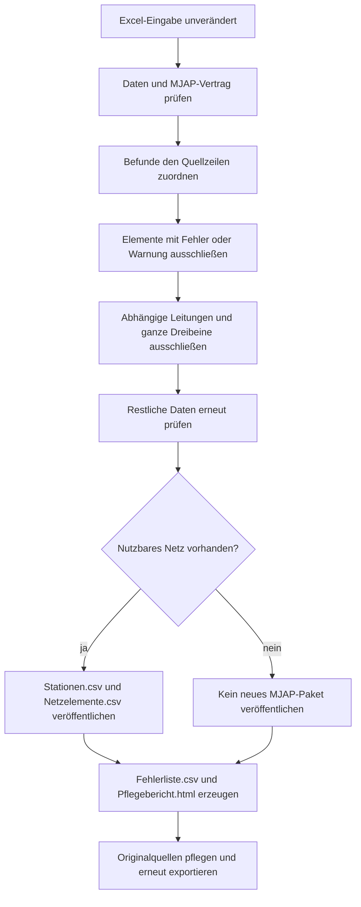

# Geprüfter Teil-Export und automatische Pflegeberichte

Stand: 07.10.2026. Die Excel-Datei ist die Eingabe. Der Parser erzeugt die CSV-Eingaben für das unveränderte MJAP-Plugin. Er verändert die Excel-Datei nicht.

```bash
.venv/bin/python converter.py "input.xlsx" -o "output" --details
```

Unter Windows:

```powershell
python converter.py "C:\Daten\input.xlsx" -o "C:\Daten\output" --details
```

## Was geschrieben wird

Der MJAP-Standardexport und `--mjap` schließen jedes Element mit einem zugeordneten Datenfehler **oder einer zugeordneten Datenwarnung** aus. Dazu zählen beispielsweise eine reparierte Koordinate, eine abweichende Stationsbenennung, ein fehlender Anschluss, eine ungültige ID, ein fehlendes IBN oder ein umgekehrtes Datumsintervall. Automatische Reparaturen reichen somit nicht mehr zur Freigabe: Der Originalwert muss in Excel gepflegt werden.

Ein Ausschluss gilt für den ganzen Datensatz, nicht nur die fehlerhafte Zelle. Bei doppelten Elementkennungen werden alle betroffenen Datensätze ausgeschlossen. Wird eine Station ausgeschlossen, werden ihre referenzierenden Leitungen ebenfalls ausgeschlossen. Bei einem Dreibein werden alle drei Leitungszeilen gemeinsam ausgeschlossen, sobald ein Bein oder eine benötigte Station ausfällt. Der Parser exportiert kein beschädigtes Rest-Dreibein.

Alle verbleibenden Elemente werden erneut konvertiert und geprüft. Der abschließende MJAP-Vertrag prüft das verbleibende Netz vor dem Schreiben. Die festen 20 Stations- und 30 Netzelementspalten, Datumsformate, Dezimalkommas und tatsächlich leeren T-/Y-Zellen bleiben erhalten. Bestehende Ausgabedateien werden bei erfolgreichem Teil-Export vollständig durch den geprüften verbleibenden Bestand ersetzt; ausgeschlossene Elemente fehlen in der Karte.



## Automatische Dateien im Ausgabeordner

| Datei | Inhalt | Verwendung |
| --- | --- | --- |
| `Stationen.csv` | Ausschließlich freigegebene Stationen | MJAP-Eingabe |
| `Netzelemente.csv` | Ausschließlich freigegebene Leitungen/Elemente | MJAP-Eingabe |
| `Fehlerliste.csv` | Fehler, Warnungen und begründete Folgeausschlüsse | In Excel öffnen, filtern und abarbeiten; kein MJAP-Input |
| `Pflegebericht.html` | Exportstatus, Anzahlen, Befunde und ursprüngliche Eingabewerte der betroffenen Excel-Zeilen | Offline im Browser öffnen; kein MJAP-Input |

Die Berichte entstehen ohne `--issue-file`, auch bei fehlerfreier Eingabe (CSV nur mit Kopfzeile) und bei einem fachlichen Abbruch. `--issue-file` bleibt als zusätzlicher Bericht im bisherigen CSV-/Textformat verfügbar. Ist der Ausgabeordner nicht beschreibbar, kann der Parser dort auch keinen Bericht erzeugen und meldet dies im Terminal.

| Spalte in Fehlerliste.csv | Datentyp / Bedeutung |
| --- | --- |
| `Schweregrad` | Text: `ERROR` oder `WARNING` |
| `Quelldatei` | Text: Dateipfad zur Excel-Eingabe oder zur Begleit-CSV |
| `Blatt` | Text: Excel-Blattname; leer bei einer CSV oder wenn Excel nicht lesbar ist |
| `Quellzeile` | Ganze Zahl: ursprüngliche physische Zeile, einschließlich Titel-/Headerzeilen; leer bei einem tabellenweiten Befund |
| `ELEMENT ID` | Text: ursprüngliche Elementkennung; bei Begleitdaten Projekt-/Schaltungskennung |
| `ELEMENT-TYPE` | Text: ursprünglicher normalisierter Typ, bei Begleitdaten `Projekt`/`Freischaltung` |
| `Feld` | Text: zu pflegende Spalte(n), soweit zuordenbar |
| `Wert` | Text: beanstandeter Original- oder abgeleiteter Wert; leere Werte als `<empty>` |
| `Problem` | Text: Ursache; vorhandene Validatoren formulieren teilweise auf Englisch |
| `Erwartet` | Text: erwarteter Wert beziehungsweise Regel, soweit vorhanden |
| `Pflegehinweis` | Text: Korrektur-/Wiederholungshinweis |

Die CSV verwendet Kommatrennung und UTF-8 mit BOM. Im HTML-Bericht sind Eingabewerte als Text maskiert. Die Originalwerte werden dort gezeigt; der Parser erzeugt keine neue Excel-Eingabedatei mit erfundenen Korrekturen.

## Pflegeablauf

1. `Pflegebericht.html` öffnen und den Exportstatus prüfen.
2. `Fehlerliste.csv` nach Quelldatei, Quellzeile und Elementkennung filtern. Ein Element kann mehrere Befunde haben; die Befundanzahl ist deshalb nicht gleich der Zahl ausgeschlossener Elemente.
3. Ursache in der Originalquelle korrigieren. Zuerst fehlerhafte Stationen und eigentliche Datenfehler pflegen; deren Folgeausschlüsse verschwinden beim erneuten Export, wenn alle Abhängigkeiten wieder gültig sind.
4. Bei Dreibeinen alle drei Excel-Beine und den virtuellen SUB-Knoten prüfen. Namen, IDs und Koordinaten bleiben tatsächliche Eingabedaten.
5. Denselben Exportbefehl erneut ausführen. Die Berichte werden neu erzeugt und enthalten nur die Befunde des aktuellen Laufs.
6. Den veröffentlichten Bestand und die ausgeschlossenen Elemente vor dem QGIS-Import prüfen.

## Vollständiges Viererpaket

```bash
.venv/bin/python converter.py input.xlsx --mjap \
  --freischaltungen QUELLE_Freischaltungen.csv \
  --projekte QUELLE_Projekte.csv -o output
```

Auch fehlerhafte Projekt-/Schaltungszeilen werden ausgeschlossen und mit ihrer CSV-Quelle und CSV-Zeilennummer berichtet. Projekte dürfen keine ausgeschlossene Station referenzieren; Schaltungen dürfen kein ausgeschlossenes Netzelement oder Projekt referenzieren. Keine Referenzliste wird durch Weglassen einzelner Stationen stillschweigend verkürzt.

Das unveränderte MJAP benötigt im vollständigen Assistenten weiterhin alle vier Tabellen und mindestens einen echten Projekt- und Schaltungsdatensatz. Falls die Prüfung eine dieser Tabellen vollständig leert, wird das Viererpaket nicht veröffentlicht. Excel allein erzeugt nur die beiden Netztabellen; fehlende Geschäftsdaten werden nicht erfunden. Leere Begleittabellen beseitigen diesen Bedarf nicht.

## Abbrüche und Status

| Exit-Code | Bedeutung |
| --- | --- |
| `0` | Export veröffentlicht; kein Element ausgeschlossen |
| `3` | Geprüfter Teil-Export veröffentlicht; ausgeschlossene Elemente in den Berichten |
| `2` | Fachlicher/technischer Konvertierungsabbruch; kein neues MJAP-Paket, außer ausdrücklich gemeldeten Berichtsfehlern nach Veröffentlichung |
| `1` | Unerwarteter Fehler oder Benutzerabbruch |

Fehlende Pflichtspalten, unlesbare Dateien oder ein beschädigtes Gesamtschema erlauben keine sichere Zuordnung zu einzelnen Elementen und führen zum Abbruch. Wenn keine nutzbare Leitung verbleibt, wird kein leeres MJAP-Paket geschrieben: Das würde wieder ein leeres `sk_df` im Plugin erzeugen. Bei einem Abbruch können ältere CSVs im Ausgabeordner verbleiben; sie stammen nicht aus dem aktuellen Lauf. Der Bericht nennt diesen Zustand ausdrücklich.

`--strict` verlangt für MJAP einen vollständigen Export ohne Datenfehler oder Datenwarnungen und bricht andernfalls vor dem Schreiben der Netztabellen ab. `--legacy` behält ausdrücklich das historische Format/Fehlerverhalten und ist keine geeignete MJAP-Eingabe. Allgemeine Betriebs-/Bibliotheksmeldungen ohne Bezug zu einem Element, etwa eine fehlende optionale Relevanzspalte oder eine pandas-Datumswarnung im Plugin, sind keine elementbezogenen Datenbefunde.

Die Python-API bleibt kompatibel: `runConversion(..., mjapNetwork=True, excludeFindings=True)` aktiviert Teil-Export und automatische Berichte; `mjap=True` wählt das Viererpaket. Ohne `excludeFindings` bleibt das bisherige API-Verhalten erhalten.

Ein [vollständiges Dummy-Beispiel](beispiel/teil-export/README_DE.md) zeigt Excel-Eingabe, ausgeschlossene Elemente, verbleibende CSVs und beide automatisch erzeugten Berichte.
